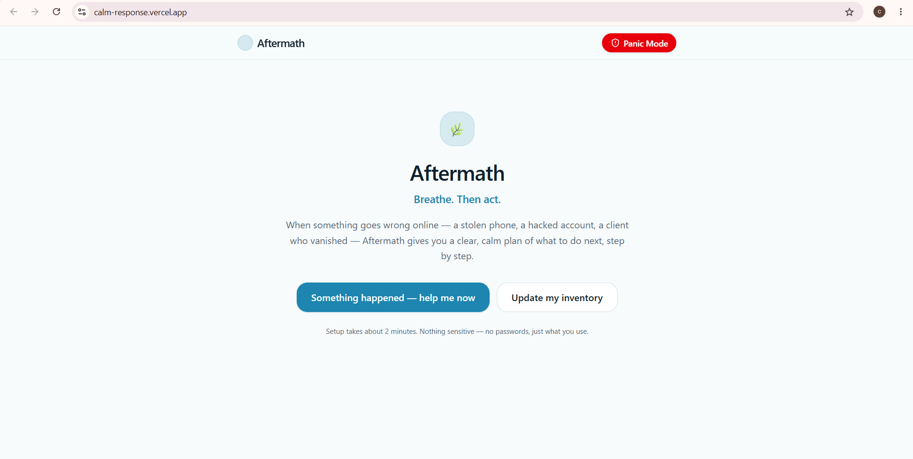
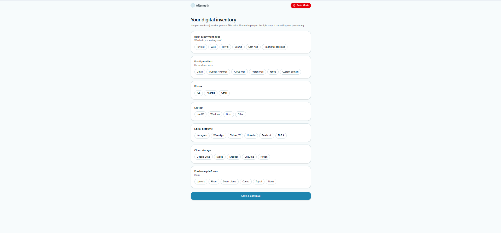
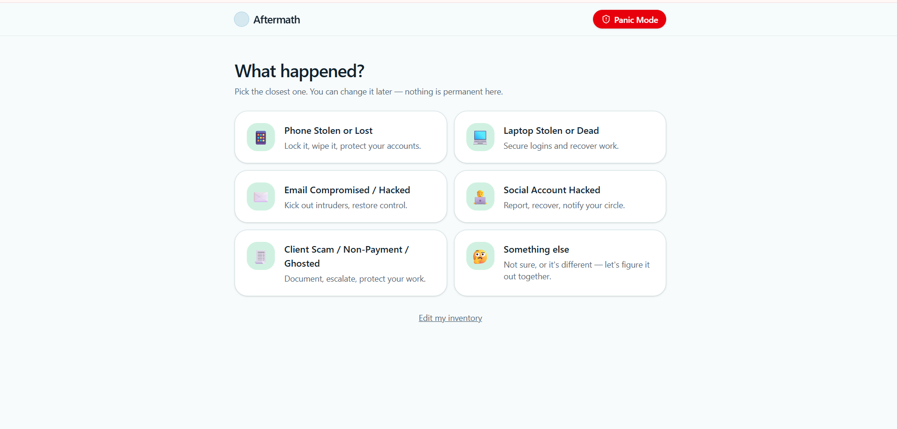
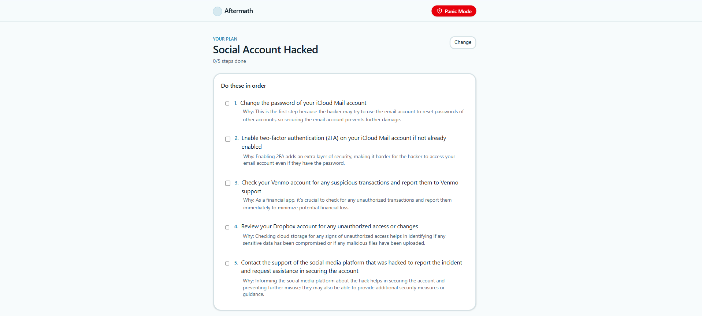
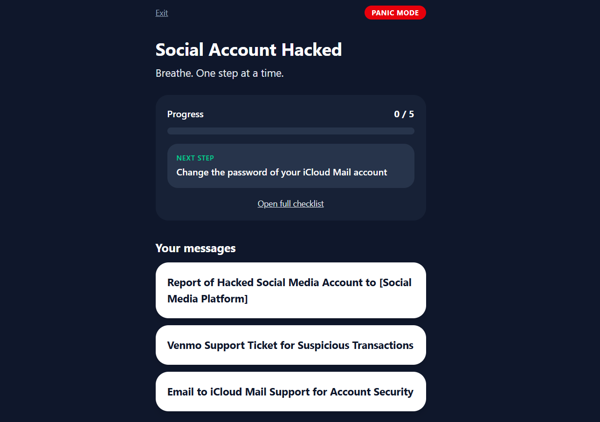

# Aftermath

**Breathe. Then act.**

Aftermath is an AI-powered incident-response co-pilot for the moment right after something goes wrong with your phone, your accounts, or your client work. It turns panic into an ordered, personalized checklist, so you know exactly what to do first, second, and third, instead of freezing or doing things in the wrong order.

---

## Table of Contents

- [The Problem](#the-problem)
- [Why I Built This](#why-i-built-this)
- [What It Does](#what-it-does)
- [Who It's For](#whos-its-for)
- [Live App](#live-app)
- [How It Works (End to End)](#how-it-works-end-to-end)
- [Features](#features)
- [Panic Mode: Why It's Different](#panic-mode-why-its-different)
- [The AI Feature](#the-ai-feature)
- [Tools, Services, and AI Models Used](#tools-services-and-ai-models-used)
- [Why These Tools](#why-these-tools)
- [Screenshots](#screenshots)
- [Architecture](#architecture)
- [Data & Privacy](#data--privacy)
- [Known Limitations / Next Steps](#known-limitations--next-steps)
- [How to Run the Project Locally](#how-to-run-the-project-locally)

---

## The Problem

When something goes wrong digitally (your phone is stolen, your email gets hacked, a client ghosts you after you deliver work), the advice that exists online is generic, scattered across ten different articles, and not ordered by urgency. In the actual moment of panic, people waste the most critical minutes just figuring out **what to do first**, often doing things in the wrong order (e.g., trying to remember passwords before securing the one account that resets all the others). There is no single place that says: "here is your situation, here is your setup, here is exactly what to do, in order, right now."

## Why I Built This

This isn't a hypothetical problem, it's one almost everyone has lived through in some form: a lost phone, a hacked account, a client who disappears without paying. Existing help (support articles, generic "what to do if hacked" blog posts) assumes a one-size-fits-all setup and doesn't know anything about *your* accounts, *your* recovery methods, or *your* platforms. I wanted an app that actually knows your setup ahead of time (captured once, calmly, before anything goes wrong) so that in the actual moment of crisis, it can generate a plan specific to you instead of a generic checklist you have to adapt yourself under stress.

## What It Does

Aftermath asks you, once, to describe your digital setup, not passwords, just *what you use* (which bank apps, which email provider, where your OTPs land, which cloud storage, which freelance platforms). Later, if something goes wrong, you pick (or describe) the incident, and the app's AI feature generates:

1. A **numbered, correctly ordered action plan**, tailored to your inventory, with a short reason for *why* each step comes where it does.
2. **Ready-to-send message drafts**, a bank fraud report, a police complaint, a platform support ticket, pre-written so you just fill in placeholders and send.

You then work through the plan as a checklist, either on the normal Action Plan screen or in **Panic Mode**, a stripped-down, high-contrast view built for when you're actually stressed and need to see only the next step, not the whole list.

## Who It's For

Anyone with a phone and online accounts, but especially useful for **students and freelancers**, who tend to juggle many platforms, payment apps, and client relationships with no formal backup plan or IT department to call if something breaks.

## Live App

**[https://calm-response.vercel.app](https://calm-response.vercel.app)**

---

## How It Works (End to End)

1. **First visit → Inventory Setup.** The user fills out a one-time form describing their digital setup: banking/payment apps, email provider, OTP/recovery contact, social accounts in use, phone/laptop OS, cloud storage, freelance platforms. No passwords or secrets are ever requested or stored.
2. **Inventory is saved** to the database (Supabase), scoped to that device, and can be revisited and edited any time from the Home screen.
3. **Something happens.** The user opens the app and lands on the **Incident Picker**, six paths: Phone Stolen/Lost, Laptop Stolen/Dead, Email Compromised, Social Account Hacked, Client Scam/Non-Payment/Ghosted, or **Something Else** (free text, for anything not covered by the fixed five).
4. **The app sends the user's saved inventory + the incident description** to the AI model (Groq, running Llama 3.3 70B) through a server-side function, using a fixed system prompt written specifically for this task (see [The AI Feature](#the-ai-feature)).
5. **The AI returns structured JSON**, an ordered list of steps (each with a reason) and 2-3 message drafts, which the app parses and renders as an interactive checklist and copy-ready message cards.
6. **The user works through the plan**, checking off steps as they go, either on the full Action Plan screen (which shows everything: full plan, reasons, and messages) or by switching to **Panic Mode** (which shows only the next unchecked step, nothing else).
7. **Progress is saved continuously**, inventory and checklist state persist across refreshes and app closures, scoped per device.

## Features

- **Digital inventory setup**: one-time, no-passwords setup capturing what apps/services the user relies on
- **Editable inventory**: revisit and update it any time as your setup changes
- **6 incident paths**: 5 fixed, 1 open-ended free-text ("Something else") that still produces a full tailored plan
- **AI-generated, ordered action plan**: numbered steps, each with a short "why this order" explanation, built from the user's actual inventory rather than generic advice
- **Ready-to-send message drafts**: bank fraud reports, police complaints, platform support tickets, with one-tap copy and clearly marked placeholders (e.g. `[YOUR NAME]`, `[ACCOUNT NUMBER]`) for anything the app doesn't know
- **Interactive checklist**: check off each step as you complete it; progress is tracked visually
- **Panic Mode**: a calm, distraction-free, high-contrast screen for the actual moment of crisis (see below)
- **Persistence**: inventory and checklist progress are saved to the database and survive a page refresh or closed tab
- **Per-device data protection**: reads/writes are scoped so one browser/device can never see or touch another device's data

## Panic Mode: Why It's Different

Panic Mode exists because the **normal Action Plan screen and Panic Mode are built for two different mental states**, not just two different looks:

- **The Action Plan screen** is for when you're gathering your bearings: it shows everything at once: the full ordered list, the reasoning behind each step, and every message draft, so you can read, scroll, and understand the whole situation.
- **Panic Mode** is for when you're actively mid-crisis and reading a full list is the *last* thing that helps. Decision fatigue and information overload make people freeze. So Panic Mode deliberately hides everything except **the single next unchecked step** and a simple progress indicator. One decision at a time, nothing else competing for attention.

The **different, high-contrast color scheme is intentional, not decorative**: it acts as a visual signal that "you are now in crisis mode," distinct from the calmer browsing color scheme of the rest of the app, similar to how emergency signage uses distinct colors so you instantly register a change in context. High contrast also matters practically: a stolen phone means you may be viewing this on someone else's screen, in bad lighting, or with shaking hands, and a bold, simple visual reduces the chance of misreading a step.

In short: **same underlying plan, two different presentations**: the full plan is for orientation, Panic Mode is for execution under stress.

## The AI Feature

When a user selects an incident (or describes one in their own words), the app sends their saved inventory and the incident description to an AI model with the following system instruction:

```
You are a calm, precise incident-response assistant. Given a user's digital
inventory and an incident type, output a numbered, strictly ordered action
plan. Prioritize actions that prevent irreversible loss first (for example,
securing account recovery paths before anything else that depends on them).
For each step, explain briefly WHY it comes in that order. Then draft 2-3
ready-to-copy messages relevant to the incident (such as a bank fraud report,
a police complaint, or a platform support ticket), using placeholders like
[YOUR NAME] or [ACCOUNT NUMBER] for details you don't have. Never suggest an
action that requires information you were not given. Keep the tone
reassuring and clear, not alarming. Respond ONLY in valid JSON with this
shape:
{
  "steps": [ { "action": "...", "reason": "..." } ],
  "messages": [ { "title": "...", "body": "..." } ]
}
```

The model returns structured JSON, which the app parses and renders as an interactive, checkable checklist and copyable message drafts on both the full Action Plan screen and the condensed Panic Mode view.

**Why this design:** the prompt forces a strict, prioritized order (irreversible-loss-prevention first) rather than a flat list, requires a "why" for each step so the user isn't just blindly following instructions, and constrains the model to never assume information it wasn't given, so it never tells a user to "log into your backup email" if they never said they had one.

## Tools, Services, and AI Models Used

| Tool | Role |
|---|---|
| **Lovable** | AI app builder used to design and build the frontend and backend logic |
| **Groq, Llama 3.3 70B Versatile** | Powers the AI action-plan generation feature, called via a server-side function so the API key is never exposed to the client |
| **Supabase** | Database for persisting inventory and checklist data (uses a public/publishable key that is safe to expose; access is scoped by a per-device identifier through server functions) |
| **GitHub** | Version control and public code hosting |
| **Vercel** | Live deployment hosting, including serverless functions for the AI and database calls |

## Why These Tools

- **Lovable** was used to move fast from idea to a working full-stack app (frontend + backend logic) without hand-wiring every piece of boilerplate, while still allowing custom logic like the AI prompt and Panic Mode behavior.
- **Groq** was chosen for the AI feature because it serves Llama 3.3 70B with very low latency, which matters for an app whose whole premise is *not making a stressed user wait*.
- **Supabase** was chosen as a lightweight, free-tier-friendly Postgres database with a simple client that made per-device persistence straightforward without needing full user accounts for an MVP.
- **Vercel** was chosen for deployment because it deploys directly from GitHub, handles serverless functions (used to keep the Groq key server-side), and has a generous free tier suitable for a student project.
- **GitHub** for standard version control and to satisfy the public-repo requirement.

## Screenshots

*(See the `/screenshots` folder in this repo.)*

| Screen | Description |
|---|---|
|  | Home screen |
|  | Digital inventory setup |
|  | Incident Picker |
|  | Generated AI Action Plan |
|  | Panic Mode |

## Architecture

```
User → Frontend (React, via Lovable)
         ↓ (incident + inventory)
      Vercel Serverless Function
         ↓                          ↓
    Groq API (Llama 3.3 70B)     Supabase (Postgres)
   (generates ordered plan +     (stores inventory +
      message drafts)             checklist progress)
```

- The **Groq API key** and any sensitive calls are made from a Vercel serverless function, never from the browser.
- The **Supabase publishable key** is safe to expose client-side; all reads/writes are scoped per device so no cross-device data leakage is possible.

## Data & Privacy

- No passwords, PINs, or account credentials are ever requested or stored, only the *names* of services/apps the user uses (e.g., "I use Google as my email provider"), never login details.
- Inventory and checklist data are scoped to the device that created them; one device cannot query or modify another device's data.
- Message drafts are generated with explicit placeholders for anything sensitive (account numbers, names) rather than the AI inventing or requesting that data.

## Known Limitations / Next Steps

- Data is currently scoped per-device rather than tied to a user account. Cross-device sync would need a lightweight login (email/OTP) added on top of the existing per-device access control.
- The "Something else" free-text path doesn't yet suggest similar past incidents users may have logged.
- No offline support yet. If a user's only device is the one that's compromised or lost, they'd need a second device or browser to access their plan.

## How to Run the Project Locally

1. Clone the repo:
   ```bash
   git clone https://github.com/Qurat123567/calm-response.git
   cd calm-response
   ```
2. Install dependencies:
   ```bash
   npm install
   ```
3. Create a `.env` file in the root with:
   ```
   GROQ_API_KEY=your_groq_key_here
   SUPABASE_URL=your_supabase_url
   SUPABASE_PUBLISHABLE_KEY=your_supabase_publishable_key
   SUPABASE_PROJECT_ID=your_supabase_project_id
   VITE_SUPABASE_URL=your_supabase_url
   VITE_SUPABASE_PUBLISHABLE_KEY=your_supabase_publishable_key
   VITE_SUPABASE_PROJECT_ID=your_supabase_project_id
   ```
4. Run the dev server:
   ```bash
   npm run dev
   ```
5. Open the local URL shown in your terminal.
